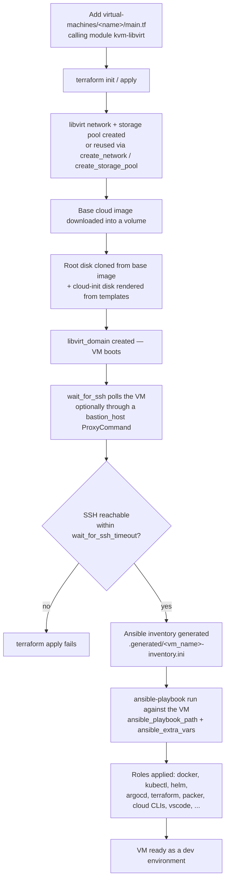

# libvirt-devbox

Terraform (or OpenTofu) + Ansible tooling that provisions KVM/libvirt virtual machines — locally or on a remote hypervisor reached over SSH — and configures them into ready-to-use virtual macbines.

**Tech stack:** Terraform / OpenTofu (HCL) · [dmacvicar/libvirt](https://registry.terraform.io/providers/dmacvicar/libvirt) provider · Ansible · cloud-init · Go 1.26 (`tools/version-check`) · GitHub Actions

**Key features:**

- **Reusable VM module** ([modules/kvm-libvirt](modules/kvm-libvirt)) — one `module` block provisions a libvirt network, storage pool, base cloud image, root disk, and cloud-init config; network/pool/base image can be created fresh or shared across VMs in the same fleet.
- **Automatic post-boot configuration** — once the VM answers SSH, Terraform generates an Ansible inventory and runs a playbook against it, no manual login required.
- **Bastion/jump-host support** — VMs on a libvirt network that isn't directly routable (e.g. a remote KVM host) can be reached transparently through a jump host for both the SSH wait and the Ansible connection.
- **Automated dependency freshness** — [tools/version-check](tools/version-check) plus a [weekly GitHub Action](.github/workflows/version-check.yml) diff the pinned tool versions in `ansible/roles` against upstream releases and open a PR when one drifts.

## Prerequisites & System Requirements

**On the machine that runs Terraform/Ansible:**

| Tool | Version | Notes |
| --- | --- | --- |
| Terraform | `~> 1.15` | or OpenTofu `~> 1.12` (see [versions.tf](modules/kvm-libvirt/versions.tf) / [versions.tofu](modules/kvm-libvirt/versions.tofu)) |
| Ansible | any recent (`ansible-playbook` on `PATH`) | invoked via a Terraform `local-exec` provisioner |
| OpenSSH client | any | used to wait for the VM and, optionally, to proxy through a bastion |
| Go | `1.26+` | only needed to build [tools/version-check](tools/version-check) |

**On the KVM/libvirt host** (can be the same machine, or a remote one reached over SSH):

- Linux with hardware virtualization enabled (`/dev/kvm` present)
- `qemu-kvm` and `libvirtd` installed and running
- Enough disk space for the base cloud image plus each VM's root disk (defaults to 20 GiB per VM, `root_disk_size_bytes`)
- Your user in the `libvirt`/`kvm` groups (or root)

## Installation

```sh
# 1. Clone the repository
git clone <this-repo-url> libvirt-devbox
cd libvirt-devbox

# 2. Install Terraform (or use OpenTofu — see snap/apt/tfenv equivalents)
# https://developer.hashicorp.com/terraform/install
curl -fsSL https://apt.releases.hashicorp.com/gpg | sudo gpg --dearmor -o /usr/share/keyrings/hashicorp-archive-keyring.gpg
echo "deb [signed-by=/usr/share/keyrings/hashicorp-archive-keyring.gpg] https://apt.releases.hashicorp.com $(lsb_release -cs) main" | sudo tee /etc/apt/sources.list.d/hashicorp.list
sudo apt update && sudo apt install terraform

# 3. Install Ansible
sudo apt install ansible

# 4. Install libvirt/KVM on the host that will run the VMs
sudo apt install qemu-kvm libvirt-daemon-system libvirt-clients
sudo usermod -aG libvirt,kvm "$USER"
newgrp libvirt

# 5. Make sure you have an SSH keypair to inject into the VM
ls ~/.ssh/id_ed25519.pub || ssh-keygen -t ed25519 -f ~/.ssh/id_ed25519
```

## Quick Start / Usage

The fastest path to a running VM is the self-contained [minimal example](modules/kvm-libvirt/examples/minimal), which provisions a single Ubuntu VM on a local `qemu:///system` libvirt connection with no Ansible step.

```sh
cd modules/kvm-libvirt/examples/minimal
```

Edit `main.tf` to point at your own key (it currently has a placeholder):

```hcl
module "vm" {
  source = "../.."

  ssh_authorized_keys = ["ssh-ed25519 AAAA...replace-with-your-key... you@example"]
  deploy_ssh_key      = "~/.ssh/id_ed25519"

  cloudinit_user_data_template      = "${path.module}/templates/user_data.yml.tftpl"
  cloudinit_network_config_template = "${path.module}/templates/netplan.yml.tftpl"

  network_cidr  = "192.168.122.0/24"
  vm_ip_address = "192.168.122.10"

  base_image_source = "https://cloud-images.ubuntu.com/releases/22.04/release/ubuntu-22.04-server-cloudimg-amd64.img"
}
```

Then provision it:

```sh
terraform init
terraform apply
```

Once `apply` finishes, the VM is reachable directly:

```sh
ssh -i ~/.ssh/id_ed25519 ubuntu@192.168.122.10
```

To also run an Ansible playbook against the VM after boot (as the [devops](virtual-machines/devops) deployment does), add `ansible_playbook_path` to the `module` block — see [modules/kvm-libvirt](modules/kvm-libvirt#usage) for the full input reference, and [modules/kvm-libvirt/examples](modules/kvm-libvirt/examples) for the `basic` (shared network/pool/image) and `jump-host` (bastion) variants.

## Repository layout

| Path | Purpose |
| --- | --- |
| [modules/kvm-libvirt](modules/kvm-libvirt) | Reusable Terraform module: provisions one VM and optionally runs an Ansible playbook against it once reachable over SSH. |
| [modules/kvm-libvirt-kubernetes](modules/kvm-libvirt-kubernetes) | Placeholder for a future Kubernetes-flavored variant of the module. |
| [virtual-machines/devops](virtual-machines/devops) | `devops` — the ultimate VM, provisioned with devops tools, CLIs, and clients. |
| [virtual-machines/kubernetes-dev](virtual-machines/kubernetes-dev) | Placeholder for a future Kubernetes dev-environment deployment. |
| [ansible/roles](ansible/roles) | Shared Ansible roles applied to provisioned VMs. |
| [tools/version-check](tools/version-check) | Go tool that compares pinned `*_version` defaults in `ansible/roles` against upstream releases and can bump them in place. |
| [.github/workflows/version-check.yml](.github/workflows/version-check.yml) | Weekly workflow that runs `version-check -apply` and opens a PR when a tool has a newer upstream release. |

## Deployment flow



- Network, storage pool, and base image can each be created fresh or reused from another module call (`create_network`, `create_storage_pool`, `create_base_volume`) so multiple VMs in the same fleet can share them.
- When the VM's libvirt network isn't directly reachable, `bastion_host`/`bastion_user`/`bastion_ssh_key` route both the SSH wait and the Ansible connection through a jump host.
- Ansible provisioning is entirely optional — omitting `ansible_playbook_path` stops the module after the VM boots.

## Keeping tool versions current

[tools/version-check](tools/version-check) and its [weekly GitHub Action](.github/workflows/version-check.yml) keep the versions pinned in `ansible/roles/*/defaults/main.yml` in sync with upstream releases, opening a PR when one drifts out of date. See [VERSIONS.md](VERSIONS.md) if present, or the tool's own [README](tools/version-check/README.md) for details.
