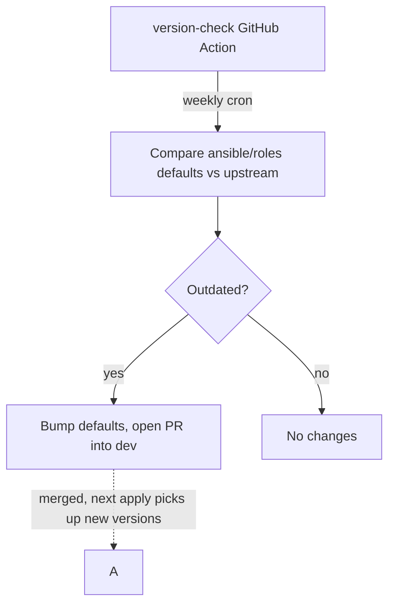

# version-check

Compares the `*_version` defaults pinned in [ansible/roles](../../ansible/roles) against the latest stable release tracked by [release-monitoring.org](https://release-monitoring.org) (Anitya), and optionally updates the defaults files in place.



## Build / run

```sh
cd tools/version-check
go build -o version-check .
```

Or run directly with `go run .` from this directory, or `go run ./tools/version-check` from the repo root.

## Usage

```
version-check [flags]
version-check help
```

Run from the repository root so the default paths resolve correctly:

```sh
# Report version drift, change nothing.
./tools/version-check/version-check -check

# Update every outdated defaults/main.yml in place.
./tools/version-check/version-check -apply

# Use an Anitya API token, and a mapping file/repo root elsewhere.
./tools/version-check/version-check -apply -token "$ANITYA_TOKEN" -map ./roles.json -repo-root ..
```

### Flags

| Flag | Description |
| --- | --- |
| `-check` | Report version drift without modifying any files. This is the default when `-apply` is not given. |
| `-apply` | Update the pinned `*_version` value in each `defaults/main.yml` whose current value doesn't match the latest stable version on Anitya. Only the matched `key: value` line is rewritten; comments, other keys, and formatting are left untouched. |
| `-token string` | Anitya API token (optional; anonymous requests work against the public read endpoints this tool uses). Sent as an `Authorization: Bearer` header when set. |
| `-map string` | Path to the role → Anitya project mapping file (default `tools/version-check/roles.json`). |
| `-repo-root string` | Repository root that the `file` path in each mapping entry is resolved relative to (default `.`). |
| `-table string` | Path to write a Markdown table of tracked tool versions (e.g. `VERSIONS.md`). Only written when at least one role was outdated and none failed to check — see [VERSIONS.md](../../VERSIONS.md). |

### Exit codes

| Code | Meaning |
| --- | --- |
| `0` | Success — either `-apply` ran cleanly, or `-check` found nothing outdated. |
| `1` | `-check` found outdated versions (nothing was modified). |
| `2` | An error occurred (bad mapping file, network failure, file I/O, etc.). |

## Versions table

Passing `-table VERSIONS.md` writes a Markdown table of every tracked tool — role, pinned version, latest upstream version, status, and the date it was last checked — to that path. It's only (re)written when at least one role was outdated during the run and none failed to check; a fully up-to-date run leaves the file untouched, so its "last checked" column can lag behind the true last check by up to one cycle.

This is how the [weekly bump workflow](../../.github/workflows/version-check.yml) keeps [VERSIONS.md](../../VERSIONS.md) up to date.

- Status only reflects whether `-apply` actually bumped a role during that run — pairing `-table` with `-check` alone (without `-apply`) will show every already-outdated role as "up to date" too, since nothing was attempted. `-table` is only meaningful paired with `-apply`, which is how the CI workflow uses it.

## Mapping file (`roles.json`)

A JSON array mapping each Ansible role's pinned version variable to the Anitya project that tracks its upstream releases:

```json
{
  "role": "golang",
  "anitya_id": 1227,
  "anitya_name": "go",
  "var": "golang_version",
  "file": "ansible/roles/golang/defaults/main.yml"
}
```

- `role` — Ansible role name, used only for output labels.
- `anitya_id` / `anitya_name` — identify the project on release-monitoring.org (the ID disambiguates same-named projects).
- `var` — the YAML key in `file` holding the pinned version string.
- `file` — path to the role's `defaults/main.yml`, resolved relative to `-repo-root`.

To track a new tool, add its role's `defaults/main.yml` entry here.
